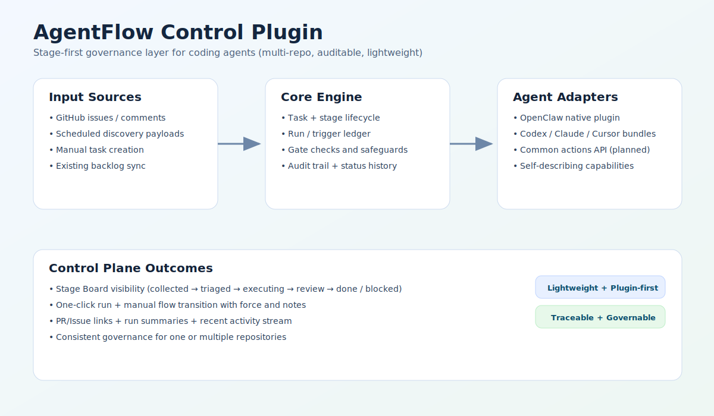
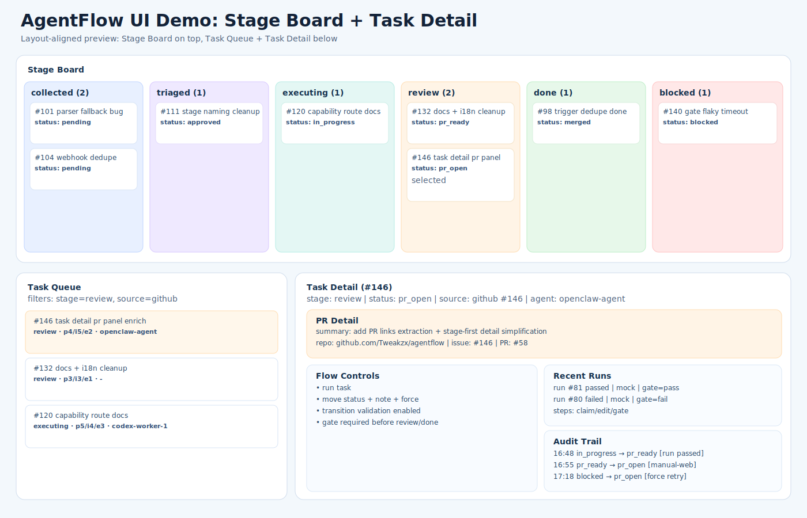

# AgentFlow

A lightweight, stage-first control plugin that upgrades coding agents with project-level task governance across one or multiple repositories.

Language: English | [中文](./README.zh-CN.md)

## Positioning

AgentFlow is not a full agent platform. It is a control layer that sits above existing agents and adds:

- issue/task discovery intake
- stage-first workflow management
- execution/run traceability
- gate-aware status transitions
- evidence-first lifecycle history
- unified ledger event contract for API/SSE/CLI/console views

## Visual Overview

Architecture overview:



Stage Board + Task Detail demo (illustrative, single image):



## What Is Implemented Today

### Core Engine (CLI + DB)

- SQLite-first storage: `projects`, `tasks`, `runs`, `triggers`, `gate_profiles`, `ledger_events`
- Task lifecycle and scoring (`next`, `claim-next`, `heartbeat`, `release`, `move`)
- Run orchestration (`run-once`, `run-batch`) with adapter protocol
- Trigger idempotency and event ingestion (`discover-issues`, `handle-comment`)
- Periodic GitHub pull ingestion (`sync-issues`)
- Gate enforcement with command checks and blocked-on-fail behavior
  - Optional safety controls: `AGENTFLOW_GATE_ALLOWED_PREFIXES`
  - Optional workspace root: `AGENTFLOW_WORKSPACE_ROOT` (for gate `cwd` resolution)

### Web Console

- Task list + status groups as top-level view
- Task center with `stage/source` filters
- Task detail with unified event timeline (`timeline`) and derived evidence signals (`derived_summary`)
- Manual transition with safeguards + optional `force`
- Recent runs + audit trail panels
- APIs:
  - `POST /api/tasks`
  - `GET /api/flow?project=<project>`
  - `GET /api/events?project=<project>&last_event_id=<id>` (SSE stream)
  - `GET /api/audit?project=<project>&limit=30`
  - `GET /api/task/<id>` (`task`, `recent_runs`, `timeline`, `derived_summary`)
  - `POST /api/task/<id>/run`
  - `POST /api/task/<id>/progress`
  - `POST /api/task/<id>/move`

### CLI Inspection (Ledger-backed)

- `agentflow audit --project <project>` now reads unified project ledger audit events
- `agentflow run-steps <run_id>` now shows run timeline ledger events (command name kept for compatibility)
- `agentflow recent-runs --project <project>` keeps run snapshots and includes latest ledger event summary per run

### Webhook Endpoints (Console)

- `POST /webhook/github/comment?project=<project>&adapter=openclaw&agent=bot`
- `POST /webhook/github/issues?project=<project>`
- `POST /webhook/github?project=<project>&adapter=openclaw&agent=bot`
- Optional signature verification: `X-Hub-Signature-256`
- Comment webhooks are queued asynchronously (fast ACK + background run)

### OpenClaw Native Plugin

Path: `plugins/openclaw-agentflow/`

Exposed capabilities:

- Commands: `agentflow.run`, `agentflow.create`, `agentflow.move`, `agentflow.detail`, `agentflow.audit`, `agentflow.help`
- Tools: `agentflow_status`, `agentflow_capabilities`, `agentflow_create_task`, `agentflow_move_task`, `agentflow_task_detail`, `agentflow_recent_runs`, `agentflow_audit`
- Routes:
  - `GET /agentflow/capabilities`
  - `POST /agentflow/webhook/comment`
  - `POST /agentflow/webhook/issues`
  - `POST /agentflow/webhook/github`

## Quick Start

```bash
python -m venv .venv
source .venv/bin/activate
pip install -e .

agentflow init --db ./data/agentflow.db
agentflow create-project demo --repo your-org/your-repo
agentflow add-task --project demo --title "example task" --priority 4 --impact 4 --effort 2
agentflow serve --db ./data/agentflow.db --host 127.0.0.1 --port 8787
```

Open `http://127.0.0.1:8787`.

## Why This Project Is Attractive

- Lightweight by default: local SQLite, low ops burden
- Plugin-first: can enhance existing agent stacks instead of replacing them
- Stage-first UX: easier human control for multi-issue execution
- Strong governance: transition validation + gate-aware promotion
- Traceability: `ledger_events` is the source of truth; `tasks/runs` remain snapshot state
- Multi-repo ready: one control plane for several repositories

## Project Comparison (High-Level)

| Project Type | Typical Focus | AgentFlow Difference |
|---|---|---|
| Full agent platforms | End-to-end hosted execution platform | AgentFlow is a lightweight control plugin, not a platform replacement |
| Single-task coding agents | Solve one issue/task very well | AgentFlow focuses on project-level queueing, flow, and governance |
| Generic workflow builders | Broad automation orchestration | AgentFlow is purpose-built for coding-task lifecycle and repository workflows |
| Agent orchestration frameworks | Build custom multi-agent graphs | AgentFlow provides opinionated task/run/audit primitives out of the box |

## Roadmap (Planned)

### Phase 1: Universal Plugin Surface

- Stable cross-agent action set (`pm.capabilities`, `pm.discover`, `pm.run`, `pm.move`, `pm.sync`)
- Thin adapters for OpenClaw/Codex/Claude/Cursor ecosystems

### Phase 2: Provider Hardening

- Formal provider contract (discover/create/update/sync)
- Better repository binding and multi-repo bootstrap experience

### Phase 3: Collaboration & Governance

- Policy presets (solo/strict/fast modes)
- Stronger session continuity and task-context reuse across multi-round edits

## Testing

```bash
cd "$(git rev-parse --show-toplevel)"
PYTHONPATH=src python3 -m unittest discover -s tests -p 'test_*.py' -v
```

PR-blocking E2E suite (same entry used by GitHub Actions):

```bash
cd "$(git rev-parse --show-toplevel)"
./scripts/run_pr_blocking_e2e.sh
```

## Plugin Packaging

- OpenClaw native plugin: `plugins/openclaw-agentflow/`
- Bundle templates:
  - `plugins/bundles/codex/`
  - `plugins/bundles/claude/`
  - `plugins/bundles/cursor/`
