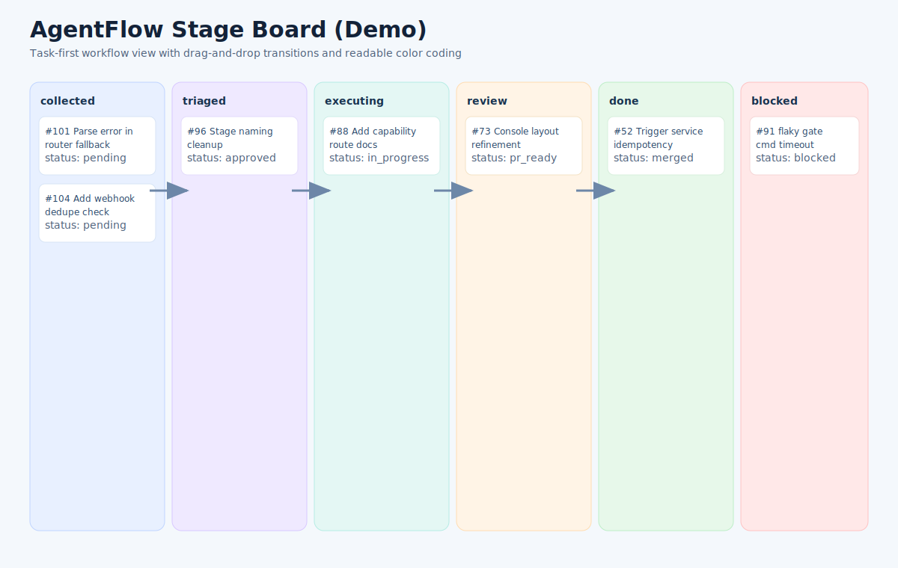

# AgentFlow（中文）

AgentFlow 是一个轻量、Stage（阶段）优先的控制插件，用来增强现有 Coding Agent 在一个或多个仓库内的项目级任务治理能力。

语言：中文 | [English](./README.md)

## 项目定位

AgentFlow 不是完整 Agent 平台，而是叠加在已有 Agent 之上的控制层，提供：

- issue/task 发现入口
- stage-first 流程管理
- 执行与运行记录追踪
- gate 门禁感知的状态推进
- 可审计的全流程状态历史

## 可视化概览

架构示意图：


Stage Board 演示图（示意）：



## 当前已实现能力

### 核心引擎（CLI + DB）

- SQLite 优先存储：`projects`、`tasks`、`status_history`、`runs`、`run_steps`、`triggers`、`gate_profiles`
- 任务生命周期与排序：`next`、`claim-next`、`heartbeat`、`release`、`move`
- 运行编排：`run-once`、`run-batch`（通过 adapter 协议）
- 触发幂等与事件接入：`discover-issues`、`handle-comment`
- 门禁执行：命令检查 + fail 时阻塞

### Web 控制台

- Stage Board 顶层视图（支持拖拽切换阶段）
- 任务中心（`stage/source` 筛选）
- 任务详情（PR 导向面板 + 相关链接）
- 人工流转（带规则校验，支持 `force`）
- Recent Runs + Audit Trail 面板
- API：
  - `GET /api/flow?project=<project>`
  - `GET /api/audit?project=<project>&limit=30`
  - `POST /api/task/<id>/run`
  - `POST /api/task/<id>/move`

### Webhook 入口（控制台）

- `POST /webhook/github/comment?project=<project>&adapter=mock&agent=bot`
- `POST /webhook/github/issues?project=<project>`
- `POST /webhook/github?project=<project>&adapter=mock&agent=bot`
- 可选签名校验：`X-Hub-Signature-256`

### OpenClaw 原生插件

路径：`plugins/openclaw-agentflow/`

已暴露能力：

- Commands：`agentflow.run`、`agentflow.help`
- Tools：`agentflow_status`、`agentflow_capabilities`
- Routes：
  - `GET /agentflow/capabilities`
  - `POST /agentflow/webhook/comment`
  - `POST /agentflow/webhook/issues`
  - `POST /agentflow/webhook/github`

## 快速开始

```bash
python -m venv .venv
source .venv/bin/activate
pip install -e .

agentflow init --db ./data/agentflow.db
agentflow create-project demo --repo your-org/your-repo
agentflow add-task --project demo --title "example task" --priority 4 --impact 4 --effort 2
agentflow serve --db ./data/agentflow.db --host 127.0.0.1 --port 8787
```

打开 `http://127.0.0.1:8787`。

## 为什么这个项目有吸引力

- 轻量默认：本地 SQLite，运维负担低
- 插件优先：增强现有 Agent，而不是替换整个平台
- Stage-first：多问题并行时更适合人工把控
- 治理更强：状态迁移校验 + gate 感知推进
- 可追踪：runs/triggers/status_history/audit 全链路
- 多仓库友好：一个控制面管理多个仓库项目

## 项目对比（高层）

| 项目类型 | 常见侧重点 | AgentFlow 的区别 |
|---|---|---|
| 完整 Agent 平台 | 托管式端到端执行平台 | AgentFlow 是轻量控制插件，不替代平台 |
| 单任务 Coding Agent | 强化单 issue 求解能力 | AgentFlow 强调项目级队列、流程与治理 |
| 通用工作流平台 | 泛自动化编排 | AgentFlow 面向代码任务生命周期做了专门抽象 |
| 多 Agent 编排框架 | 自定义多代理图编排 | AgentFlow 内置任务/运行/审计原语，可直接落地 |

## 路线规划（Roadmap）

### Phase 1：通用插件接口

- 稳定跨 agent 动作集合：`pm.capabilities`、`pm.discover`、`pm.run`、`pm.move`、`pm.sync`
- OpenClaw/Codex/Claude/Cursor 等生态的薄适配器

### Phase 2：Provider 强化

- 标准 provider 协议（discover/create/update/sync）
- 更好的多仓库绑定与初始化体验

### Phase 3：协作与治理增强

- 策略预设（solo/strict/fast）
- 更强会话连续性与多轮任务上下文复用

## 测试

```bash
cd /home/shawn/github/agentflow
PYTHONPATH=src python3 -m unittest discover -s tests -p 'test_*.py' -v
```

## 插件打包

- OpenClaw 原生插件：`plugins/openclaw-agentflow/`
- 其他生态 bundle 模板：
  - `plugins/bundles/codex/`
  - `plugins/bundles/claude/`
  - `plugins/bundles/cursor/`
